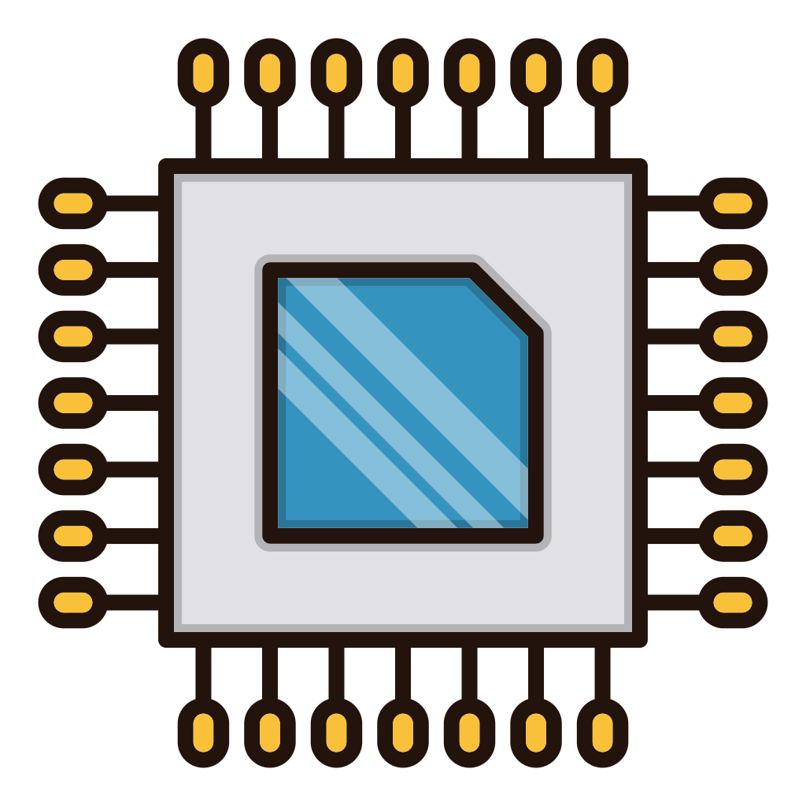
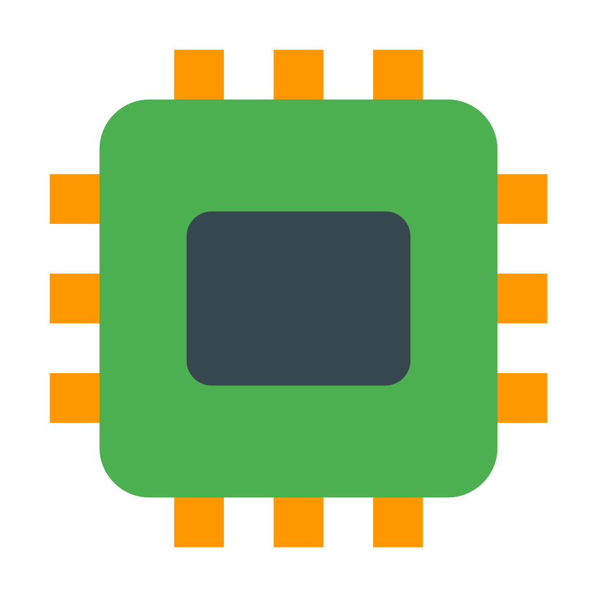

[🇬🇧 English](README.md) | [🇵🇪 Español](README.es.md)

<!-- Header / Introduction -->
<h1 align="center"> Hola soy <em>dff bulb-light</em> (David) </h1>
<h3 align="center"> </h3>

  

---

## 🧰 Herramientas y tecnologías

| Campo | Descripción |
|--------|------------------------------|
|  | Control automático, robótica y sistemas digitales |
|  | Programación de microcontroladores: ATMEGA, ESP32, PIC, STM32 |
|  | Diseño y ensamblado de placas PCBs a medida |
|  | Machine learning para control y electrónica |
|  | Python para control y electrónica |

---

## 🔭 Proyectos actuales

- [ELEMSYS](https://github.com/elemsys) — Un equipo de profesionales dedicados a la ✨ electrónica ✨
- [Desarrollo en STM32](https://youtube.com/playlist?list=PLBDyYA13fp41LdoVMGLIUoNY3WetsT-L-&si=WKzNnylpBHTQo-nj) — Programación del STM32 para aplicaciones de control automático y FPGAs
- [Desarrollo en Arduino y ESP32](https://github.com/bulb-light/ArduinoProjects_dff) -  Programación de tarjetas Arduino y ESP32 para aplicaciones de control automático y FPGAs

---

## 📂 Proyectos destacados

| Proyecto | Descripción | Herramientas y tecnologías |
|---|---|---|
| [Modeling, Simulation, Design and Comparative Analysis of the PID and LQR Controllers for an Inverted Pendulum](https://ieeexplore.ieee.org/document/10833454) | Un estudio de técnicas de control para un sistema de péndulo invertido | MATLAB, Webots, latex |
| [Péndulo invertido en Webots](https://github.com/elemsys/InvertedPendulumWebotsV1_0) | Simulación del péndulo invertido | Webots, C lang |
| [Controlador PID discreto para el control de temperatura](https://github.com/bulb-light/ArduinoProjects_dff/tree/main/TemperatureControlLM35) | Este proyecto implementa un controlador PID digital para un proceso térmico utilizando un Arduino Nano y un sensor de temperatura LM35 | C++, C, Arduino |

> Mantente actualizado para más proyectos

---

## 📝 Blog

- ⏳ En proceso ...

---

## 💡 Habilidades / Intereses

- Resolución de problemas y algoritmos  
- Contribución al software libre
- Mentorías / asesoramientos

- Disfruto de un buen libro, caminar y una dosis de café

---

## 📈 GitHub Stats

<!-- You can use “github-readme-stats” here -->

  

---

## 📫 Contáctame

| Plataforma | Link |
|---|---|
| Email | davidcs.ee.10@gmail.com |
| LinkedIn | [david](https://www.linkedin.com/in/davidcsee/) |
| Tiktok | [david_dff_bulblight](https://www.tiktok.com/@david_dff_bulblight)|
| YouTube| [david-dff](https://www.youtube.com/@david-dff-bulblight)|

---

## 🔗 Conectar & Colaborar

Estoy dispuesto a colaborar en software libre, proyectos paralelos o mentorías.  
Ten la confianza de contactarme!

---

*“Vives una vez, pero si lo haces bien, una vez es suficiente.”*

