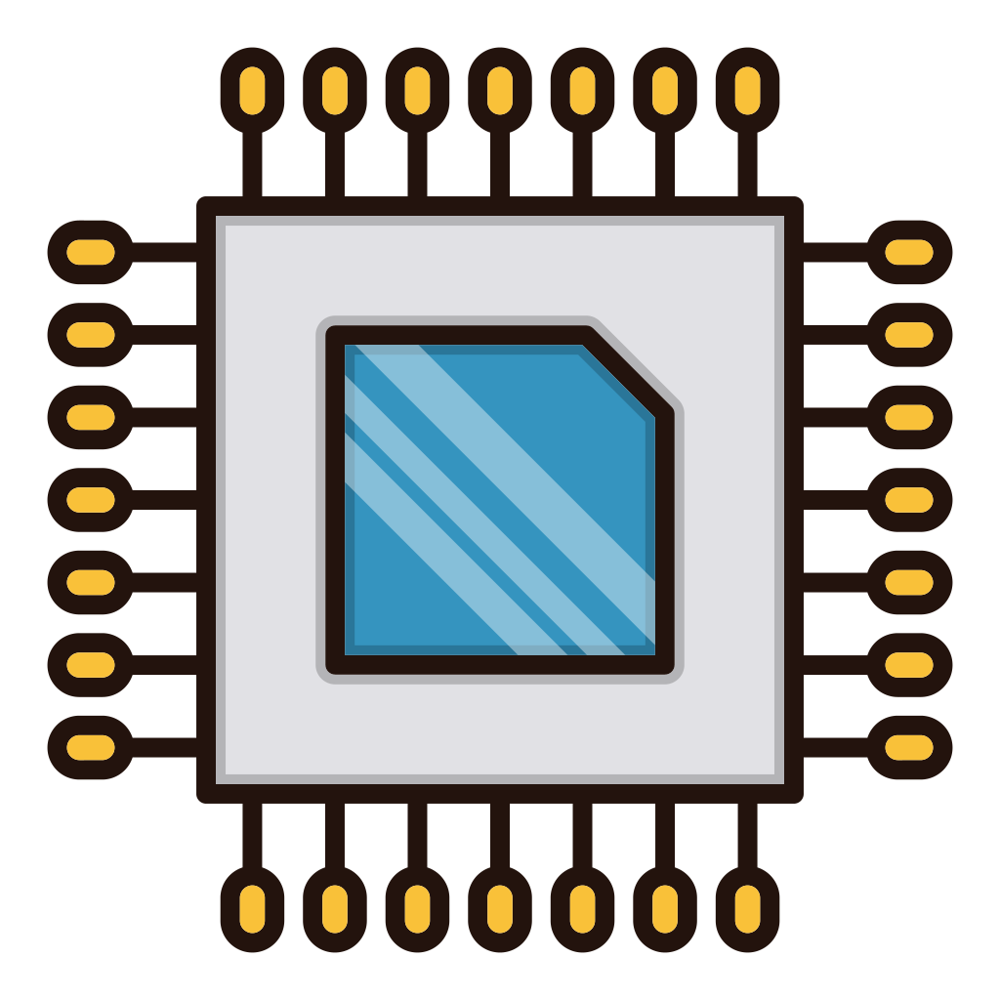

[🇬🇧 English](README.md) | [🇵🇪 Español](README.es.md)

<!-- Header / Introduction -->
<h1 align="center"> Hi I'm <em>dff bulb-light</em> (David) </h1>
<h3 align="center"> </h3>

  

---

## 🧰 Tech Stack & Tools

| Domain | Description |
|--------|------------------------------|
|  | Automatic control, robotics and  digital systems |
|  | Microcontroller programming: ATMEGA, ESP32, PIC, STM32 |
|  | Custom PCB design and assembly |
|  | Artificial intelligence and machine learning for control and electronics |
|  | Python programming for electronics|

---

## 🔭 Currently Working On

- [ELEMSYS](https://github.com/elemsys) — A team of professionals devoted to ✨ electronics ✨
- [STM32 development](https://youtube.com/playlist?list=PLBDyYA13fp41LdoVMGLIUoNY3WetsT-L-&si=WKzNnylpBHTQo-nj) — Programming STM32 microcontrollers for control systems and FPGA applications
- [Arduino and ESP32 development](https://github.com/bulb-light/ArduinoProjects_dff) -  Programming Arduino and ESP32 boards for control systems and FPGA applications

---

## 📂 Some Featured Projects

Below are a few projects I'm especially proud of.  
Click the title to explore.

| Project | Description | Tools and Tech Stack |
|---|---|---|
| [Modeling, Simulation, Design and Comparative Analysis of the PID and LQR Controllers for an Inverted Pendulum](https://ieeexplore.ieee.org/document/10833454) | A study on control techniques for a classical inverted pendulum system | MATLAB, Webots, latex |
| [Inverted pendulum on Webots](https://github.com/elemsys/InvertedPendulumWebotsV1_0) | Simulation of the inverted pendulum system | Webots, C lang |
| [Discrete PID controller implementation for temperature control](https://github.com/bulb-light/ArduinoProjects_dff/tree/main/TemperatureControlLM35) | This project implements a digital PID controller for a thermal process using an Arduino Nano and an LM35 temperature sensor | C++, C, Arduino |

> Stay tuned for upcoming projects

---

## 📝 Blog / Writings

- ⏳ Upcomming...

---

## 💡 Things I’m Good At / Interests

- Problem solving & algorithms  
- Open source contribution  
- Mentoring / teaching

- I enjoy reading, going for walks, and having coffee

---

## 📈 GitHub Stats

<!-- You can use “github-readme-stats” here -->

  

---

## 📫 How to Reach Me

| Platform | Handle / Link |
|---|---|
| Email | davidcs.ee.10@gmail.com |
| LinkedIn | [david](https://www.linkedin.com/in/davidcsee/) |
| Tiktok | [david_dff_bulblight](https://www.tiktok.com/@david_dff_bulblight)|

---

## 🔗 Connect & Collaborate

I’m open to collaboration on open source, side projects, or mentoring.  
Feel free to reach out!

---

*“You only live once, but if you do it right, once is enough.”*
